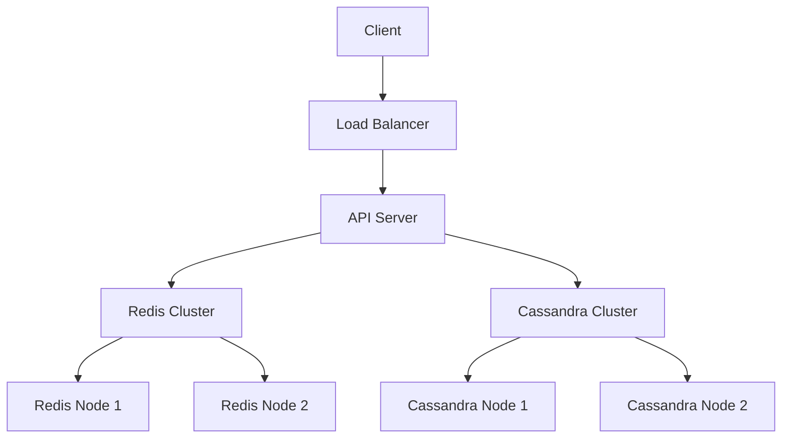

# Cache

## Definition

A cache is a high-speed storage layer that stores frequently accessed data to reduce latency and alleviate load on
primary data stores (e.g., databases). It temporarily holds data in memory or fast storage, enabling quick retrieval for
read-heavy workloads.

---

## Why It Matters

Caching is critical for improving system performance and scalability, especially in applications with high read
traffic (e.g., social media, e-commerce). By reducing database queries, caches lower latency and operational costs. In
system design interviews, caching tests your ability to optimize for speed and handle trade-offs like consistency vs.
performance.

---

## Key Concepts

### 1. Cache Types

- **In-Memory Cache**:
    - **Definition**: Stores data in RAM for ultra-low latency.
    - **How It Works**: Uses key-value stores to cache data (e.g., `user_id → profile`).
    - **Examples**: Redis, Memcached.
    - **Use Cases**: Session storage, API response caching.
    - **Trade-offs**:
        - **Pros**: Extremely fast (sub-millisecond latency).
        - **Cons**: Limited by RAM size, volatile storage.
- **Distributed Cache**:
    - **Definition**: Spreads cache across multiple nodes for scalability.
    - **How It Works**: Partitions data using consistent hashing or sharding.
    - **Examples**: Redis Cluster, Amazon ElastiCache.
    - **Use Cases**: Large-scale web applications (e.g., Netflix).
    - **Trade-offs**:
        - **Pros**: Scales horizontally, high availability.
        - **Cons**: Network latency, complex setup.
- **Local Cache**:
    - **Definition**: Stores data on the application server or client.
    - **How It Works**: Caches data in-process (e.g., JVM heap) or browser.
    - **Examples**: Guava Cache, browser cache (HTTP).
    - **Use Cases**: Low-latency access for small datasets.
    - **Trade-offs**:
        - **Pros**: Zero network latency.
        - **Cons**: Limited capacity, inconsistent across servers.

### 2. Cache Eviction Policies

- **Definition**: Rules for removing data when the cache is full.
- **Examples**:
    - **Least Recently Used (LRU)**: Evicts least recently accessed items (e.g., Redis LRU).
    - **Least Frequently Used (LFU)**: Evicts least frequently accessed items.
    - **Time-To-Live (TTL)**: Evicts data after a set expiration time.
- **Use Cases**: LRU for frequently accessed data; TTL for temporary data (e.g., session tokens).
- **Trade-offs**:
    - **Pros**: Efficient use of cache space.
    - **Cons**: May evict critical data if policy is poorly chosen.

### 3. Cache Patterns

- **Cache-Aside (Lazy Loading)**:
    - **How It Works**: Application checks cache; if data is missing (cache miss), it queries the database and updates
      the cache.
    - **Examples**: Common in Redis with web apps.
    - **Use Cases**: Dynamic data with unpredictable access patterns.
    - **Trade-offs**:
        - **Pros**: Simple, flexible.
        - **Cons**: Cache miss latency, potential for stale data.
- **Write-Through**:
    - **How It Works**: Writes go to cache and database simultaneously.
    - **Examples**: Used in systems needing strong consistency.
    - **Use Cases**: Critical data (e.g., user profiles).
    - **Trade-offs**:
        - **Pros**: Ensures cache-database consistency.
        - **Cons**: Higher write latency.
- **Write-Back (Write-Behind)**:
    - **How It Works**: Writes go to cache first, then asynchronously to the database.
    - **Examples**: Used in high-throughput systems.
    - **Use Cases**: Write-heavy workloads (e.g., logging).
    - **Trade-offs**:
        - **Pros**: Low write latency.
        - **Cons**: Risk of data loss if cache fails before write.

### 4. Cache Invalidation

- **Definition**: Process of updating or removing stale cache data.
- **How It Works**: Uses TTL, manual invalidation, or event-driven updates.
- **Examples**: Invalidate cache on database updates (e.g., Redis `DEL` on user profile change).
- **Use Cases**: Keeping cache consistent with source data.
- **Trade-offs**:
    - **Pros**: Prevents stale data.
    - **Cons**: Complex to manage in distributed systems.

---

## Real-World Examples

- **Redis at Twitter**: Caches user timelines to reduce database load, using LRU eviction.
- **Memcached at Facebook**: Stores frequently accessed objects (e.g., user sessions) for low-latency reads.
- **Amazon ElastiCache**: Distributed Redis for e-commerce product catalogs, scaling to millions of QPS.
- **Cloudflare CDN**: Caches static content (e.g., images) at edge locations for global low latency.

---

## Trade-offs

- **Cache vs. Database**:
    - Cache: Fast reads but limited capacity and potential staleness.
    - Database: Persistent storage but higher latency.
- **In-Memory vs. Distributed Cache**:
    - In-Memory: Lower latency but limited scale.
    - Distributed: Scales horizontally but adds network overhead.
- **Cache Patterns**:
    - Cache-Aside: Simple but risks stale data.
    - Write-Through: Consistent but slower writes.
    - Write-Back: Fast writes but risks data loss.

---

## Important Notes

- **Choose the Right Cache**:
    - Use in-memory caches (e.g., Redis) for low-latency needs.
    - Use distributed caches for large-scale systems.
- **Eviction Policy**:
    - Select LRU for general use, TTL for temporary data.
- **Cache Invalidation**:
    - Plan for staleness (e.g., use TTL or event-driven updates).
- **Capacity Estimation**:
    - Estimate cache size (e.g., 1M users × 1KB = 1GB).
    - Estimate hit rate (e.g., 80% cache hits reduce database QPS).
- **Monitoring**:
    - Track cache hit/miss ratios to optimize performance.
- **Interview Tip**:
    - Clarify if the system prioritizes latency, consistency, or scalability when proposing a cache.

---

## Interview Guidance

### Common Interview Questions

1. **Explain caching and its benefits in system design**:
    - Discuss latency reduction and database offloading with examples (e.g., Redis at Twitter).
2. **Design a caching system for a specific use case**:
    - Example: Cache for a social media feed.
3. **What are the trade-offs of different cache patterns?**:
    - Compare cache-aside, write-through, and write-back.

### Tips for Interviews

- **Clarify Requirements**: Ask about read/write patterns, data size, and consistency needs.
- **Use Examples**: Reference systems like Netflix (Redis) or Cloudflare (CDN).
- **Draw Diagrams**: Illustrate cache placement (e.g., between API and database).
- **Discuss Trade-offs**: Highlight latency vs. consistency vs. complexity.
- **Handle Follow-ups**: Be ready for questions like “How do you handle cache misses?” or “What if the cache fails?”

---

## Sample Interview Problem: Design a Caching System for a Social Media Feed

### Problem Statement

Design a caching system for a social media feed (e.g., Twitter) serving 100M users, with 1B feed requests/day, requiring
low-latency reads (<100ms) and eventual consistency.

### Approach

- **Functional Requirements**:
    - Cache user feeds (e.g., recent posts).
    - Support feed updates on new posts.
- **Non-Functional Requirements**:
    - Scalability: Handle 1B requests/day (~12K QPS).
    - Low latency: <100ms for feed retrieval.
    - Eventual consistency: Slight delays in feed updates are acceptable.
- **Capacity Estimation**:
    - Storage: 100M users × 10KB/feed = 1TB.
    - Throughput: 1B requests/day = ~12K QPS (90% reads).
- **Solution Components**:
    - Cache: Redis for in-memory storage of feeds.
    - Database: Cassandra for persistent storage.
    - Cache Pattern: Cache-aside for flexibility.

### Solution

- **Architecture**:
    - Cache feeds in Redis (`user_id → [post_ids]`).
    - On cache miss, query Cassandra and update Redis.
    - Invalidate cache on new posts (e.g., `DEL user:<user_id>:feed`).
    - Use LRU eviction with 24-hour TTL.
- **Schema**:
    - Redis: `user:<user_id>:feed` (list of post IDs).
    - Cassandra: Table `posts` (`user_id`, `post_id`, `content`, `timestamp`).
- **Consistency**:
    - Eventual consistency for feed updates.
    - Write new posts to Cassandra, then invalidate Redis cache.
- **Scalability**:
    - Use Redis Cluster for horizontal scaling.
    - Shard Cassandra by `user_id`.
- **Trade-offs:**
    - Cache-Aside: Simple but cache miss latency.
    - Redis: Low latency but limited by RAM.
    - Eventual Consistency: Fast reads but possible stale feeds.
- **Scalability:**
    - Add Redis nodes for higher QPS.
    - Increase Cassandra replicas for fault tolerance.
- **Architecture Diagram**:

---

## Resources

- Designing Data-Intensive Applications by Martin Kleppmann
- [System Design Primer: Caching](https://github.com/donnemartin/system-design-primer?tab=readme-ov-file#cache)
- Redis Documentation: https://redis.io/docs/