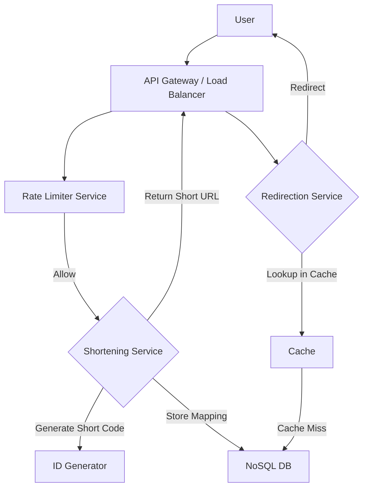

# Rate Limiting

## Definition

Rate limiting is a crucial system design technique used to control the rate at which an API or service can be accessed
by a user or client within a specific time window. Its primary role in system design is to prevent abuse, ensure fair
resource allocation, protect against denial-of-service (DoS) attacks, and maintain the stability and availability of the
service.

---

## Why It Matters

Rate limiting is essential in system design for several reasons:

- **Abuse Prevention:** It stops malicious users from spamming an API, scraping data excessively, or launching
  brute-force attacks.

- **Resource Management:** Ensures that no single user or client monopolizes server resources, leading to a fair
  distribution for all legitimate users.

- **Cost Control:** For services with per-request billing, rate limiting can prevent unexpected high charges due to
  excessive usage.

- **System Stability:** By preventing overload, it helps maintain the performance and availability of the service,
  especially during traffic spikes.

- **Real-world Applications:** Used extensively in public APIs (e.g., Twitter, Stripe, GitHub), payment gateways, login
  systems, and search engines.

- **Interviews:** A very common topic in system design interviews, demonstrating an understanding of robustness,
  security, and scalability.

---

## Key Concepts

### 1. Fixed Window Counter

- **Definition:** This is the simplest rate limiting algorithm. It counts the number of requests within a fixed time
  window (e.g., 1 minute).
- **How It Works:** A counter is associated with each client. When a request arrives, the system checks if the counter
  for the current time window has exceeded the limit. If not, the counter is incremented, and the request is allowed. At
  the end of the window, the counter is reset.
- **Examples:** Redis (using `INCR` and `EXPIRE` commands), in-memory counters.
- **Use Cases:** Simple APIs where occasional bursts at the window edges are acceptable.
- **Trade-offs:**
    - **Pros:** Easy to implement, low overhead.
    - **Cons:** Can allow for "bursts" of requests at the edges of the window (e.g., a client can make `N` requests just
      before the window ends and another `N` requests just after it resets, effectively making `2N` requests in a very
      short
      period).

### 2. Sliding Log

- **Definition:** This algorithm keeps a log of timestamps for each request made by a client.
- **How It Works:** When a request comes in, the system removes all timestamps from the log that are older than the
  current
  time minus the window duration. If the number of remaining timestamps (including the new request) is within the limit,
  the request is allowed, and its timestamp is added to the log.
- **Examples:** Databases with time-series capabilities, Redis (using `ZADD` and `ZRANGEBYSCORE` with
  `ZREMRANGEBYSCORE`).
- **Use Cases:** Scenarios where precise rate limiting without edge-case bursts is critical, and resource consumption
  for
  storing logs is acceptable.
- **Trade-offs:**
    - **Pros:** Very accurate, no burst issue at window edges.
    - **Cons:** High memory consumption as it stores a timestamp for every request. CPU intensive for large numbers of
      requests due to log management.

### 3. Sliding Window Counter

- **Definition:** A hybrid approach that addresses the burst issue of Fixed Window Counter while being more
  memory-efficient
  than Sliding Log. It combines two fixed window counters: one for the current window and one for the previous window.
- **How It Works:** When a request arrives, the system calculates a weighted average of the counts from the current and
  previous windows, based on how much of the current window has elapsed.
    - `(previous_window_count * (time_remaining_in_current_window / window_size)) + current_window_count`
    - If this calculated count is within the limit, the request is allowed, and the current window counter is
      incremented.

- **Examples:** Can be implemented using Redis or similar key-value stores.
- **Use Cases:** A good balance between accuracy and resource efficiency for most general-purpose rate limiting.
- **Trade-offs:**
    - **Pros:** Reduces the burst problem significantly compared to Fixed Window, more memory-efficient than Sliding
      Log.
    - **Cons:** Still not perfectly accurate in all scenarios, but a good approximation. Requires careful
      synchronization if
      distributed.

### 4. Token Bucket

- **Definition:** A flexible algorithm that allows for bursts up to a certain size while also enforcing a sustained
  rate.
- **How It Works:** Imagine a bucket with a fixed capacity for "tokens." Tokens are added to the bucket at a constant
  rate. Each time a request arrives, the system attempts to remove a token from the bucket. If a token is available, the
  request is processed. If the bucket is empty, the request is denied or queued.
- **Examples:** Nginx `limit_req`, API gateways like Apigee, Redis (using Lua scripts for atomicity).
- **Use Cases:** Scenarios requiring burst tolerance, network traffic shaping, and API rate limiting where sustained
  usage is more important than strict window adherence.
- **Trade-offs:**
    - **Pros:** Allows for controlled bursts, smooths out traffic, simple to understand and implement.
    - **Cons:** Requires careful tuning of bucket capacity and refill rate.

### 5. Leaky Bucket

- **Definition:** Similar to Token Bucket but with a slightly different analogy. Requests are put into a "bucket" that
  has a
  fixed outflow rate (leaks at a constant rate).
- **How It Works:** Incoming requests are added to a queue (the bucket). Requests are processed from the queue at a
  constant
  rate. If the queue is full, incoming requests are dropped.
- **Examples:** Network traffic shapers, system load balancers.
- **Use Cases:** Scenarios where processing requests at a constant rate is crucial, useful for smoothing out bursts of
  traffic.
- **Trade-offs:**
    - **Pros:** Guarantees a steady output rate, good for smoothing traffic.
    - **Cons:** Can introduce latency if the bucket fills up, doesn't handle bursts as flexibly as Token Bucket (drops
      requests if full).

---

## Real-World Examples

- **Netflix:** Uses rate limiting extensively to protect its APIs from abuse and ensure a smooth experience for millions
  of users. They likely employ a combination of algorithms, including distributed counters for high-volume requests and
  more sophisticated techniques for critical API calls.

- **Twitter API:** Publicly documents its rate limits for various endpoints (e.g., X posts per 15 minutes). This is a
  classic example of fixed window rate limiting.

- **Stripe API:** Implements robust rate limiting to prevent fraudulent activity and protect their payment processing
  infrastructure. They use a combination of techniques, likely involving token buckets for burst handling.

---

## Trade-offs

- **Accuracy vs. Complexity:** Sliding Log is most accurate but complex and resource-intensive. Fixed Window is simple
  but less accurate. Sliding Window and Token Bucket offer good compromises.
- **Memory vs. CPU:** Sliding Log consumes more memory (storing timestamps). Fixed/Sliding Window and Token Bucket are
  generally more memory-efficient but might require more CPU for calculations or distributed synchronization.
- **Burst Tolerance vs. Strictness:** Token Bucket allows for controlled bursts, while Leaky Bucket aims for a steady
  outflow. Fixed/Sliding Window are stricter about per-window limits.
- **Distribution Overhead:** Implementing rate limiting in a distributed system (multiple servers) requires careful
  synchronization of counters/buckets, leading to increased complexity and potential network overhead.

---

## Important Notes

- **Choose the Right Algorithm:** The best rate limiting algorithm depends on your specific requirements:
    - **Fixed Window:** Simple, good for general low-to-medium traffic.
    - **Sliding Window:** Better for reducing burstiness, good general-purpose choice.
    - **Sliding Log:** Highly accurate, but resource-intensive for high request volumes.
    - **Token Bucket:** Excellent for burst tolerance and smoothing traffic.
    - **Leaky Bucket:** Good for constant processing rates and traffic shaping.

- **Identify the Limiting Key:** Decide what you're limiting by: IP address, user ID, API key, geographical location,
  etc.
- **Granularity:** Define the time window (seconds, minutes, hours) and the limit within that window.
- What to do when limit is reached:
    - Return `HTTP 429` Too Many Requests.
    - Provide `Retry-After` header.
    - Log the event for analysis.
    - Queue requests (for non-time-sensitive operations).

- **Distributed Rate Limiting:** This is often the trickiest part. Solutions involve a centralized data store (e.g.,
  Redis,
  ZooKeeper) or a distributed consensus mechanism.

- **Edge Cases:** Consider what happens during network partitions, server restarts, or clock skew in distributed
  systems.

---

## Interview Guidance

### Common Interview Questions

- Explain the different rate limiting algorithms and their trade-offs.
- Design a rate limiter for an API with millions of users.
- How would you implement a distributed rate limiter?
- What are the challenges of implementing rate limiting in a microservices architecture?
- Compare and contrast Token Bucket and Leaky Bucket algorithms.
- How would you handle a user exceeding their rate limit?
- What data structure would you use to implement a Sliding Log rate limiter?

### Tips for Interviews

- **Clarify Requirements:** Always start by asking about functional and non-functional requirements. What is the limit?
  What
  is the time window? What is the desired behavior when the limit is reached? Is burst tolerance needed? Is it for a
  single service or distributed?

- **Use Examples:** Reference real-world systems (e.g., Twitter, Stripe) and explain how they might use different rate
  limiting strategies.

- **Draw Diagrams:** Illustrate your chosen algorithm's flow or the system architecture for a distributed rate limiter.

- **Discuss Trade-offs:** For every design decision, explain the pros and cons, especially regarding accuracy,
  performance,
  memory, and complexity.

- **Handle Follow-ups:** Anticipate questions like "What if the Redis instance goes down?" or "How do you prevent race
  conditions?" Discuss solutions like replication, failover, and atomic operations (e.g., Redis Lua scripts).

---

## Sample Interview Problem: Design a URL Shortening Service with Rate Limiting

### Problem Statement

Design a scalable URL shortening service (like Bitly) that can handle 10,000 requests per second (RPS) for URL
shortening and 100,000 RPS for URL redirection. Implement rate limiting to prevent abuse, allowing each user to shorten
a maximum of 100 URLs per minute.

### Approach

- **Functional Requirements:**
    - Shorten long URLs to short URLs
    - Redirect short URLs to long URLs
- **Non-Functional Requirements:**
    - **High Availability:** The service should be always accessible.
    - **Low Latency:** Redirection should be fast.
    - **Scalability:** Handle millions of URLs and high traffic.
    - **Durability:** Shortened URLs should not be lost.
    - **Rate Limiting:** 100 shortens/user/minute.

- **Capacity Estimation:**
    - **Storage:** If 10M new URLs per day, 365 days * 10M = 3.65B URLs per year. Assuming 100 bytes per entry (
      short_code, long_url, user_id, timestamp), 3.65B * 100 bytes = 365GB per year. This suggests a distributed NoSQL
      database.
    - **Throughput:** 10K shorten QPS, 100K redirect QPS. This implies a need for robust database and caching layers.

- **Solution Components:**
    - **API Gateway/Load Balancer:** For request routing and initial rate limiting.
    - **URL Shortening Service:** Generates unique short codes and stores mappings.
    - **URL Redirection Service:** Retrieves long URLs based on short codes and performs redirection.
    - **Database:** For storing short_code -> long_url mappings (e.g., Cassandra, HBase for scale; or MySQL with
      sharding).
    - **Cache:** For popular short URLs to reduce database load (e.g., Redis, Memcached).
    - **Rate Limiter Service:** A dedicated service or component responsible for applying rate limits.

### Solution

- **Architecture**:
- **1. URL Shortening Flow:**
    - User sends `POST /shorten` request with `longUrl` and `userId`.
    - **API Gateway/Load Balancer:** Routes request.
    - **Rate Limiter Service** (Key: `userId`, Algorithm: Sliding Window Counter):
        - When a request arrives, the Rate Limiter service checks if the `userId` has exceeded 100 shortens in the
          last
          minute. It uses a distributed store (e.g., Redis) to keep track of counts.
        - Key: `rate_limit:shorten:<userId>:<current_minute_window>`
        - If the limit is exceeded, return `HTTP 429`.
        - If not, increment the counter and allow the request.
    - **URL Shortening Service:** Generates a unique short code (e.g., Base62 encoding of a unique ID from a
      distributed
      ID generator like Snowflake).
    - **Stores** `(short_code, long_url, userId)` in the database.
    - Returns `short_url` to the user.

- **2. URL Redirection Flow:**
    - User accesses `GET /<short_code>.`
    - API Gateway/Load Balancer: Routes request.
    - **Cache (e.g., Redis)**: Check if short_code exists in cache. If yes, retrieve `long_url` and redirect.
    - **Database**: If not in cache, query database for `long_url` using `short_code`.
    - Store in cache for future requests.
    - Perform HTTP 301/302 redirection to `long_url`.

  > Note: Rate limiting is generally not applied to redirection as it's a read-heavy operation and users are just trying
  > to access content.

- **3. Rate Limiter Implementation Details (Sliding Window Counter):**

    - Use Redis for storing counters.
    - For each user and each minute window, store a counter.
        - `key = "rate_limit:shorten:{userId}:{minute_timestamp}"`
        - `value = current_count`

    - When a request comes:
        - Get `current_minute_timestamp` and `previous_minute_timestamp`.
        - Fetch `current_count` and `previous_count` from Redis.
        - Calculate the weighted count: `weighted_count = (previous_count * (time_elapsed_in_current_minute / 60)) +
        current_count.`
        - If `weighted_count` < 100, `INCR` `current_count` in Redis and allow.
        - Otherwise, deny.

        - Set EXPIRE on Redis keys to automatically remove old counters.

- **Trade-offs:**
    - **Sliding Window Counter:** Good balance of accuracy and efficiency for the rate limiting requirement. Less memory
      intensive than Sliding Log.
    - **Redis for Rate Limiting and Caching:** High performance for read/write operations, ideal for distributed
      counters and caching hot URLs. However, it's an in-memory store, so persistence and backup strategies are needed.
    - **Distributed Database (Cassandra/HBase):** Provides scalability and high availability for the URL mapping, but
      adds complexity in setup and maintenance.
    - **ID Generation (Snowflake):** Ensures unique, conflict-free short codes, but adds a dependency on a distributed
      ID service.

- **Scalability:**
    - **Horizontal Scaling:** All services (Shortening, Redirection, Rate Limiter) can be scaled horizontally by adding
      more instances.
    - **Database Sharding:** Shard the URL mapping database by short_code or a hash of long_url to distribute data and
      load.
    - **Caching:** Extensive caching for redirects will offload the database significantly.
    - **Asynchronous Processing:** For less critical operations (e.g., logging, analytics), use message queues (Kafka,
      RabbitMQ) to decouple and improve responsiveness
- **Architecture Diagram**:

